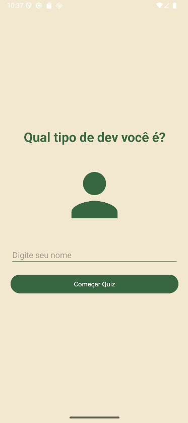
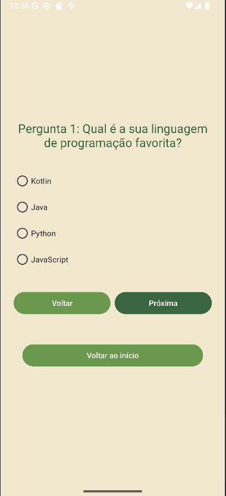
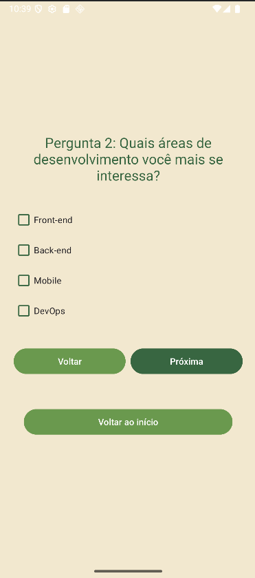
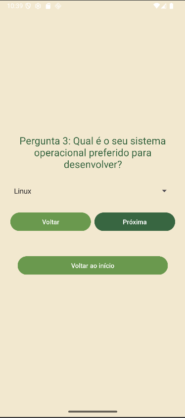
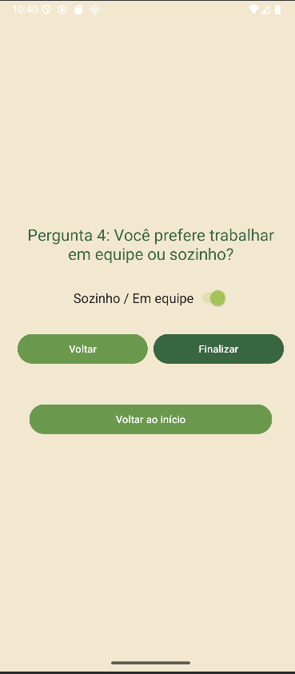
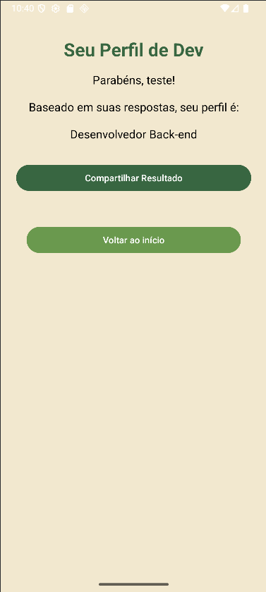

# Quiz de Personalidade: Qual Tipo de Dev Você É?

## Descrição

Este é um aplicativo Android desenvolvido como parte da avaliação AP2 da matéria de Desenvolvimento
Mobile. O app é um quiz interativo que busca identificar o perfil de desenvolvedor(a) do usuário com
base em suas respostas a 4 perguntas sobre suas preferências e interesses na área de tecnologia.

O aplicativo conduz o usuário através de um formulário de múltiplas telas, coleta as respostas e, ao
final, apresenta um perfil personalizado, como "Desenvolvedor Mobile Android Nativo", "Engenheiro
DevOps", entre outros. O resultado pode ser compartilhado em outras redes sociais.

## Funcionalidades

- **Design Agradável:** Interface com uma paleta de cores moderna em tons de verde.
- **Quiz com 4 Perguntas:** Questões de diferentes tipos (múltipla escolha, seleção única, etc.).
- **Navegação Flexível:** Botões de "Próximo" e "Voltar" em todas as telas de pergunta.
- **Estrutura com 2 Fragmentos:** O app utiliza um fragmento para a primeira pergunta e outro na
  tela final para reiniciar o quiz.
- **Múltiplas Views:** Utilização de `EditText`, `Button`, `ImageView`, `RadioButton`, `CheckBox`,
  `Spinner` e `Switch`.
- **Resultado Personalizado:** Geração de um perfil de desenvolvedor com base nas respostas.
- **Compartilhamento:** Funcionalidade de compartilhar o resultado (Intent Implícita).
- **Reiniciar o Quiz:** Opção para refazer o questionário a partir da tela de resultados.

## Instruções de Execução

1. **Clone o repositório:**
   ```bash
   git clone https://github.com/jpgiovanelli/ibmec.devmobile.20252.ap2.git
   ```
2. **Abra o projeto no Android Studio:**
    - No Android Studio, vá em `File` > `Open`.
    - Navegue até a pasta onde você clonou o projeto e selecione-a.
3. **Sincronize o Gradle:**
    - Aguarde o Android Studio sincronizar e construir o projeto automaticamente.
4. **Execute o aplicativo:**
    - Conecte um dispositivo Android ou inicie um emulador.
    - Clique no botão de `Run 'app'` (ícone de play verde) na barra superior.

## Screenshots

| Tela de Boas-Vindas |                  Pergunta 1                  |
|:-------------------:|:--------------------------------------------:|
|  |  |

|        Pergunta 2        | Pergunta 3 |
|:------------------------:|:----------:|
|  |  |

|        Pergunta 4        |    Tela de Resultado     |
|:------------------------:|:------------------------:|
| v |   |
